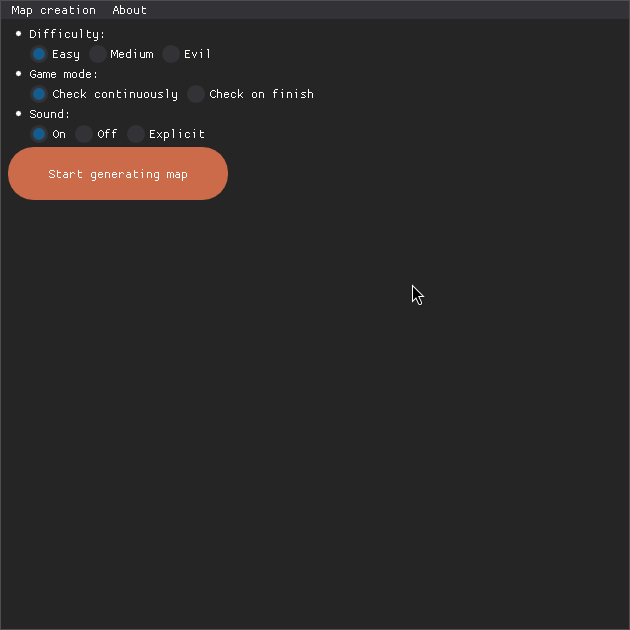
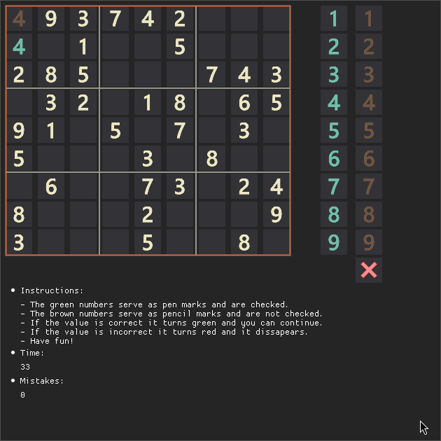

# Sudoku

A desktop Sudoku game built with [Dear PyGui](https://github.com/hoffstadt/DearPyGui), played by
dragging number tiles onto the board. Includes a built-in puzzle generator, two grading modes,
pen/pencil marks, and sound effects.



## Features

- **Three difficulty levels** — Easy, Medium, Evil — controlling how many of the 81 cells start
  hidden (43 / 49 / 56 respectively). Fewer starting digits means a harder puzzle.
- **Two game modes:**
  - *Check continuously* — every move is validated the instant you make it. A correct digit turns
    green and locks in; an incorrect one flashes red for a moment and clears itself, and gets
    logged as a mistake.
  - *Check on finish* — nothing is validated until you press **Evaluate!**, at which point the
    board is scored for correct, incorrect, and incomplete cells.
- **Pen and pencil marks** — pen marks are your committed answers (checked against the solution);
  pencil marks are scratch notes that aren't graded, for tracking candidate numbers the way you
  would in pencil on paper.
- **Sound** — On / Off / Explicit variants for the correct/incorrect/win/pencil sound effects.
- **A timer and mistake counter**, with a results popup at the end showing your time and stats.
- **A pre-generated puzzle pool** (`valid_maps.txt`, 1000+ maps) so starting a game is instant —
  loading just picks a random solved grid from the file and hides cells according to difficulty.

## How the puzzles are generated

`sudoku_map.py` is a standalone generator, separate from the puzzles served during play:

1. It picks a random permutation of 1–9 as row 1.
2. For each subsequent row it draws a random permutation and checks it against the rows accepted
   so far, enforcing that each 3×3 box and each column stays free of duplicates (row-level
   duplicates are already impossible since every row is a permutation). If a candidate row fails,
   another random permutation is tried.
3. If a full valid 9×9 grid isn't assembled within 8 seconds, the attempt is abandoned and
   restarted from scratch.
4. Once a complete grid is found, it's appended as a flat list to `valid_maps.txt`, and the
   generator immediately starts on the next one — it runs until manually stopped.

This means `valid_maps.txt` is a *pool* of pre-solved boards, built offline ahead of time. During
play, "Start generating map" doesn't generate anything live — it just picks a random line from
that file (with a short animated "loading" delay for effect) and hides the appropriate number of
cells for the chosen difficulty.

You can regenerate/extend the pool yourself from the running game: **Map creation → Start creating
maps** (and **Stop creating maps** to end the run). It keeps appending new grids to
`valid_maps.txt` for as long as it runs.

## The pen/pencil mechanic



Each board row has two draggable number tiles docked to the right of the grid: a pen version and a
pencil version, for the digit matching that row. Drag one onto any empty cell to play it:

- Dropping a **pen** tile sets a committed guess. In *continuous* mode it's checked immediately
  against the solution; in *finish* mode it's stored and graded when you hit Evaluate.
- Dropping a **pencil** tile writes a non-graded candidate note into the cell.
- A **reset** tile (bottom of the sidebar) clears a cell back to blank.

Internally, each digit image is named `image_{value}{type}.png`, where `type` is `1` (a fixed
starting clue), `2` (a pen mark), `3` (the red "incorrect" flash), or `4` (a pencil mark) — the
game reads the digit and mark type back out of the image tag when a tile is dropped on a cell.

## Requirements

- Python 3.10 or 3.11 (matches the versions this project has been run with)
- [Dear PyGui](https://github.com/hoffstadt/DearPyGui) and [Pygame](https://www.pygame.org/) (used
  for sound playback)
- A display — this is a desktop GUI app, not a headless/console one

## Running it

```bash
git clone https://github.com/kvirag-fun/sudoku-game.git
cd sudoku-game

python3 -m venv venv
source venv/bin/activate        # on Windows: venv\Scripts\activate

pip install dearpygui pygame

python sudoku_game.py
```

Pick a difficulty, game mode and sound setting on the welcome screen, click **Start generating
map**, then **Start game** once it's ready.

## Packaging

`setup.py` is a [py2app](https://py2app.readthedocs.io/) build script for bundling the game as a
standalone macOS `.app` (`python setup.py py2app`); `resources/icon.ico` is included for a Windows
build/shortcut icon.

## Project structure

```
sudoku_game.py    Main app: UI, game state, drag-and-drop handling, scoring
sudoku_map.py      Offline puzzle generator (see "How the puzzles are generated" above)
colors.py         Retro color palette used throughout the UI
text.py           UI copy: instructions, tooltips, loading-screen jokes
valid_maps.txt    Pre-generated pool of solved 9x9 grids, one per line
demo.py           Unrelated scratch file that just launches the Dear PyGui demo window
resources/        Number tile images, board icon, and sound effects
```

## Credits

- Puzzle validation reference: [sudoku-solutions.com](https://www.sudoku-solutions.com)
- Sound effects: [freesound.org — Duisterwho](https://freesound.org/people/Duisterwho/sounds/?page=19#sound)

## License

MIT — see [LICENSE](LICENSE).
